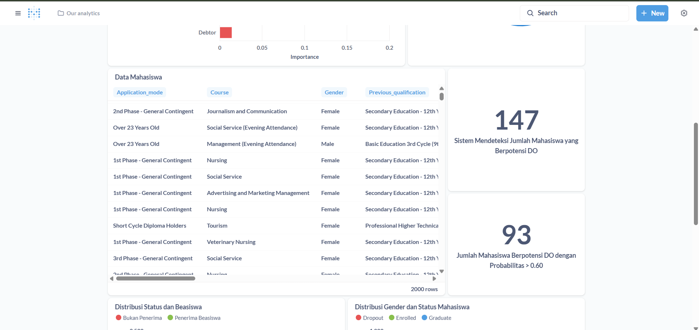

# Proyek Akhir: Menyelesaikan Permasalahan Institusi Pendidikan

## Business Understanding
Jaya Jaya Institut merupakan salah satu institusi pendidikan perguruan yang telah berdiri sejak tahun 2000. Hingga saat ini ia telah mencetak banyak lulusan dengan reputasi yang sangat baik. Akan tetapi, terdapat banyak juga siswa yang tidak menyelesaikan pendidikannya alias dropout. Jumlah dropout yang tinggi ini tentunya menjadi salah satu masalah yang besar untuk sebuah institusi pendidikan. Oleh karena itu, Jaya Jaya Institut ingin mendeteksi secepat mungkin siswa yang mungkin akan melakukan dropout sehingga dapat diberi bimbingan khusus.

## Permasalahan Bisnis

Tingginya angka dropout di Jaya Jaya Institut mengindikasikan berbagai tantangan mendasar yang perlu ditangani secara sistematis, di antaranya:

1. **Ketidaksiapan Akademik:**
   Beberapa mahasiswa mengalami kesulitan dalam mengikuti perkuliahan, yang tercermin dari nilai akademik yang rendah, banyaknya mata kuliah tidak lulus, serta frekuensi pengulangan mata kuliah.

2. **Masalah Keuangan:**
   Keterlambatan atau ketidakmampuan dalam membayar biaya pendidikan menjadi salah satu penyebab utama mahasiswa tidak dapat melanjutkan studinya.

3. **Kurangnya Motivasi atau Ketidakcocokan Program Studi:**
   Mahasiswa yang merasa kurang cocok dengan jurusan atau kehilangan motivasi dalam menjalani proses pendidikan cenderung lebih rentan terhadap dropout.

4. **Faktor Demografis:**
   Latar belakang pendidikan, usia saat mendaftar, serta kondisi sosial ekonomi dapat berkontribusi pada keputusan mahasiswa untuk tidak menyelesaikan pendidikannya.

5. **Tidak Tersedianya Sistem Deteksi Dini:**
   Saat ini belum ada sistem prediktif yang mampu mengidentifikasi mahasiswa berisiko dropout secara cepat dan akurat, sehingga intervensi seringkali dilakukan terlambat atau tidak tepat sasaran.

Permasalahan ini menuntut pendekatan berbasis data untuk menghasilkan keputusan yang cepat, tepat, dan berbasis bukti, agar Jaya Jaya Institut dapat meningkatkan retensi mahasiswa dan kualitas layanannya.


## Tujuan Proyek

Proyek ini bertujuan untuk mendukung Jaya Jaya Institut dalam mengurangi tingkat dropout mahasiswa melalui pendekatan teknologi dan analisis data, dengan sasaran utama:

* **Mengidentifikasi faktor-faktor utama** yang berkontribusi terhadap risiko mahasiswa mengalami dropout.
* **Membangun model prediktif berbasis machine learning** untuk mendeteksi mahasiswa berisiko dropout secara dini.
* **Menyediakan dashboard interaktif berbasis data** yang dapat digunakan pihak manajemen akademik untuk memantau, menganalisis, dan merancang strategi intervensi secara proaktif dan tepat sasaran.

## **Cakupan Proyek**

1. **Pengumpulan dan Pengolahan Data Siswa:**
   Meliputi data akademik, demografis, kehadiran, keuangan, dan faktor pendukung lainnya.

2. **Analisis Eksploratif (EDA):**
   Untuk memahami distribusi data, menemukan pola dropout, dan menentukan variabel yang paling berpengaruh.

3. **Pembangunan dan Pelatihan Model Machine Learning:**
   Menggunakan algoritma klasifikasi (seperti Random Forest, Logistic Regression, XGBoost, dll.) untuk memprediksi potensi dropout.

4. **Evaluasi dan Validasi Model:**
   Menilai kinerja model dengan metrik evaluasi (accuracy, recall, precision, F1-score) serta validasi silang.

5. **Pengembangan Dashboard Visualisasi:**
   Membuat dashboard yang dapat digunakan oleh staf akademik untuk melihat status risiko mahasiswa dan mendukung pengambilan keputusan.

6. **Membuat Prototipe Streamlit:** 
    Mengembangkan antarmuka pengguna sederhana menggunakan Streamlit untuk mengakses model prediksi secara interaktif. Prototipe ini akan memungkinkan pengguna memasukkan data siswa dan mendapatkan prediksi risiko dropout secara real-time.

7. **Rekomendasi Strategi Intervensi:**
   Memberikan saran berbasis output model untuk tindakan preventif terhadap mahasiswa yang terdeteksi berisiko tinggi dropout.


### Persiapan
---

Sumber data: [Dataset Students Performance](https://github.com/dicodingacademy/dicoding_dataset/blob/main/students_performance/data.csv).

Setup environment:

**1. Jalankan `notebook.ipynb`:**

Instal Dependensi: Di terminal proyek, jalankan perintah berikut.
```
pip install -r requirements.txt
```

**2. Jalankan Streamlit App (app.py):**

Pastikan Model Tersedia: Pastikan file model (rf_model2.pkl) dan encoder (onehot_encoder2.pkl) berada di dalam folder model/ di direktori proyek Anda.
Instal Streamlit (jika belum):
```
pip install streamlit
```

Jalankan Aplikasi di terminal proyek, jalankan:
```
streamlit run app.py
```

Aplikasi Streamlit akan terbuka di browser anda.

**3. Menjalankan Dashboard di Metabase Lokal**

Untuk melihat *Student Performence Dashboard* secara lokal, ikuti langkah-langkah berikut menggunakan Docker:

   1.  **Instal Docker** di perangkat Anda jika belum terinstal.
   2.  **Tarik *image* Metabase:**
       Unduh *image* Metabase versi yang ditentukan dari Docker Hub:
       ```bash
       docker pull metabase/metabase:v0.46.4
       ```
   3.  **Siapkan Folder Data Metabase:**
       Buat sebuah folder lokal (misalnya `metabase_data/`) di direktori proyek Anda. Pindahkan file database Metabase Anda (`metabase.db.mv.db` dan `metabase.db.trace.db` jika ada) ke dalam folder `metabase_data/` ini.

   4.  **Jalankan Metabase menggunakan perintah Docker:**
       Perintah ini akan memulai *container* Metabase dan memetakan folder data lokal Anda (`metabase_data/`) ke dalam *container* Metabase (`/metabase-data/`), memastikan Metabase menggunakan *database internal* yang sudah ada.
       ```bash
       docker run -d \
         -p 3000:3000 \
         --name metabase \
         -v "$(pwd)"/metabase_data:/metabase-data \
         metabase/metabase:v0.46.4
       ```
       *Catatan:* `$(pwd)` adalah *command substitution* yang akan diganti dengan direktori kerja saat ini di terminal. Ini memastikan jalur absolut ke folder `metabase_data` Anda.

   5.  **Akses Metabase di Browser:**
       Buka *web browser* Anda dan navigasikan ke alamat berikut:
       ```
       http://localhost:3000
       ```
   6.  **Login ke Metabase:**
       Gunakan kredensial berikut untuk *login*:
       * **Username:** `root@mail.com`
       * **Password:** `root123`
       
       *Dashboard* *Student Performance* dapat langsung diakses setelah *login*

## Business Dashboard





*Business Dashboard* ini dikembangkan menggunakan Metabase dan berfungsi sebagai alat visualisasi interaktif untuk memantau performa mahasiswa dan menganalisis faktor-faktor yang berkontribusi terhadap *dropout*. Dashboard ini menyediakan gambaran komprehensif mengenai status mahasiswa dan metrik kunci yang relevan, memungkinkan pengambilan keputusan berbasis data untuk meningkatkan retensi mahasiswa.

#### **Ringkasan Statistik Utama**
Bagian utama dashboard menampilkan *Key Performance Indicators* (KPI) yang memberikan gambaran cepat mengenai kondisi populasi mahasiswa saat ini.
* **Total Mahasiswa:** Menampilkan jumlah keseluruhan mahasiswa yang terdata, yaitu **4,424**.
* **Total Mahasiswa yang Telah Lulus:** Jumlah mahasiswa yang sudah menyelesaikan studi, yaitu **2,209**.
* **Total Mahasiswa yang Telah Keluar:** Jumlah mahasiswa yang *dropout* atau keluar dari institusi, yaitu **1,421**.
* **Total Mahasiswa yang Terdaftar:** Jumlah mahasiswa yang saat ini masih aktif terdaftar, yaitu **794**.
* **Total Mahasiswa yang Berpotensi Keluar:** Jumlah mahasiswa aktif yang diidentifikasi berisiko tinggi *dropout* oleh model prediksi, yaitu **147**.
* **Total Mahasiswa yang Berpotensi Tinggi Keluar:** Subset dari mahasiswa berisiko dengan tingkat kepercayaan (*probability*) di atas 65%, yaitu **93** orang yang memerlukan perhatian paling mendesak.

#### **10 Fitur Penting Teratas Penyebab Mahasiswa Keluar**
Diagram batang ini menampilkan fitur-fitur (variabel) dengan tingkat kepentingan (*importance*) tertinggi yang memengaruhi keputusan mahasiswa untuk *dropout*, berdasarkan analisis model Random Forest. 10 fitur paling penting tersebut adalah:
* `Curricular_units_2nd_sem_approved` (Jumlah SKS lulus di semester 2)
* `Curricular_units_2nd_sem_grade` (Nilai rata-rata di semester 2)
* `Curricular_units_1st_sem_grade` (Nilai rata-rata di semester 1)
* `Curricular_units_1st_sem_approved` (Jumlah SKS lulus di semester 1)
* `Age_at_enrollment` (Usia saat mendaftar)
* `Tuition_fees_up_to_date` (Status pembayaran UKT)
* `Scholarship_holder` (Penerima beasiswa)
* `Debtor` (Memiliki tunggakan)
* `Gender_Male` (Berjenis kelamin Laki-laki)
* `Application_mode_2nd Phase - General Contingent` (Jalur pendaftaran fase 2)

Fitur-fitur ini menjadi fokus utama dalam memahami dan mengatasi masalah *dropout*. Terlihat jelas bahwa **performa akademik di semester awal** adalah faktor yang paling dominan.

#### **Distribusi Persentase Mahasiswa berdasarkan Status**
Diagram donat ini menunjukkan proporsi mahasiswa berdasarkan status mereka saat ini, dengan total mahasiswa ditampilkan di tengah diagram untuk memberikan konteks.
* **Graduate (Lulus):** **50%**
* **Dropout (Keluar):** **32%**
* **Enrolled (Terdaftar):** **18%**

Visualisasi ini secara efektif menyoroti besarnya proporsi mahasiswa yang telah *dropout*, yang menegaskan urgensi dari proyek ini.

### **Analisis Visualisasi Distribusi Mahasiswa pada Dashboard**

#### 1. **Distribusi Status Mahasiswa Berdasarkan Beasiswa**

Grafik ini menunjukkan hubungan antara status mahasiswa (Dropout, Enrolled, Graduate) dan status penerima beasiswa:

* Mahasiswa **bukan penerima beasiswa** mendominasi kategori **dropout**.
* Sebaliknya, **penerima beasiswa** lebih banyak yang **berhasil lulus (graduate)**.
* Hal ini mengindikasikan bahwa **beasiswa berpotensi menjadi faktor pelindung terhadap risiko dropout**.


#### 2. **Distribusi Gender dan Status Mahasiswa**

Visualisasi ini membandingkan status mahasiswa dengan jenis kelamin:

* **Laki-laki (0)** memiliki jumlah **dropout dan graduate** yang tinggi.
* **Perempuan (1)** menunjukkan distribusi lebih seimbang antara enrolled, dropout, dan graduate.
* Terlihat bahwa **laki-laki lebih rentan mengalami dropout**, meskipun juga banyak yang lulus.


#### 3. **Distribusi Nilai Rata-rata Mahasiswa**

Grafik ini memperlihatkan rata-rata SKS lulus dan nilai akhir pada semester 1 dan 2:

* Mahasiswa **dropout** memiliki **rata-rata nilai dan SKS terendah** di semua semester.
* Mahasiswa yang **lulus** menunjukkan rata-rata nilai dan SKS yang **konsisten tinggi**.
* Temuan ini menunjukkan bahwa **prestasi akademik sangat berpengaruh terhadap kelulusan** dan risiko dropout.


#### 4. **Distribusi Umur dan Status Mahasiswa**

Distribusi status mahasiswa dikelompokkan berdasarkan rentang umur:

* Mahasiswa usia **17–20 tahun** mendominasi kategori **graduate** dan **enrolled**, menandakan mereka memiliki kecenderungan untuk menyelesaikan studi.
* Mahasiswa dengan usia **di bawah 25 tahun** cenderung memiliki **angka dropout yang tinggi**.
* Faktor usia dapat mempengaruhi kelulusan, mungkin karena faktor tanggung jawab pekerjaan atau keluarga.

####  **Kesimpulan Akhir Dashboard Deteksi Dropout Mahasiswa**

Dashboard ini memberikan gambaran menyeluruh mengenai faktor-faktor yang berkontribusi terhadap risiko **dropout (DO)** mahasiswa berdasarkan data historis. Visualisasi interaktif pada dashboard secara konsisten menunjukkan bahwa **kinerja akademik awal**—terutama jumlah SKS yang diselesaikan dan nilai pada semester 1 dan 2—merupakan **indikator paling kuat** dalam memprediksi risiko dropout.

Mahasiswa dengan **rata-rata SKS dan nilai rendah** sejak awal masa studi hampir seluruhnya berujung pada status dropout. Hal ini menjadi sinyal penting bahwa intervensi perlu difokuskan sejak semester awal perkuliahan.

Namun, dashboard juga menunjukkan bahwa risiko DO tidak hanya disebabkan oleh performa akademik semata. Terdapat sejumlah **faktor sekunder** yang memperkuat risiko ini, di antaranya:

* **Status Beasiswa:** Mahasiswa **bukan penerima beasiswa** memiliki tingkat dropout yang lebih tinggi dibandingkan yang menerima beasiswa.
* **Gender dan Usia:** Laki-laki dan mahasiswa **berusia di bawah 25 tahun** cenderung memiliki angka DO yang lebih tinggi.
* **Pilihan Program Studi:** Program studi menunjukkan risiko dropout lebih besar, kemungkinan karena beririsan dengan mahasiswa pekerja atau tanggungan lainnya.
* **Faktor Keuangan:** Meski tidak dominan, **status utang atau tunggakan pembayaran** juga tercatat sebagai penambah risiko.

Sebagai tambahan, dashboard mencatat bahwa:

* Sebanyak **147 mahasiswa terdeteksi berpotensi DO** oleh sistem.
* Dari jumlah tersebut, **93 mahasiswa memiliki probabilitas dropout lebih dari 60%**, sehingga perlu menjadi prioritas dalam program pembinaan atau intervensi.


## Menjalankan Sistem Machine Learning
Prototype sistem machine learning ini bertujuan untuk memprediksi status mahasiswa di Jaya Jaya Institut, apakah mereka akan dropout atau tidak, berdasarkan data individual mahasiswa.


Langkah-langkah Menjalankan Prototype:

1. Buka aplikasi prototype melalu [link berikut](https://predictjayamaju.streamlit.app/).

2. Isi seluruh field input pada form yang tersedia di tampilan Streamlit, yang terbagi dalam beberapa bagian 

3. Klik tombol “Prediksi”.

Sistem akan menjalankan model machine learning yang telah dilatih sebelumnya. Hasil prediksi akan muncul di bagian bawah antarmuka, misalnya:
```
⚠️ Mahasiswa kemungkinan besar Dropout. Probabilitas: 60%"
```

```
✅ Mahasiswa kemungkinan Bertahan / Lulus. Probabilitas: 78%
```

### Conclusion
---

Proyek ini berhasil mengembangkan sistem deteksi dini risiko *dropout* mahasiswa untuk **Jaya Jaya Institut**, yang merupakan langkah krusial dalam mengatasi tingginya angka *dropout*. Dengan memanfaatkan data historis mahasiswa, kami telah membangun model *machine learning* prediktif yang andal dan menyajikan wawasan penting yang dapat ditindaklanjuti, yang dapat menjadi fondasi untuk *business dashboard* interaktif.

Evaluasi model *machine learning* menunjukkan bahwa algoritma **Random Forest** memberikan kinerja terbaik setelah melalui proses optimasi. Hasil evaluasi pada data uji adalah sebagai berikut:

* **Best Parameters:** `{'max_depth': None, 'min_samples_split': 2, 'n_estimators': 200}`
* **Accuracy:** **0.8985 (89.85%)**
* **Classification Report:**
    ```
                  precision    recall  f1-score   support

               0       0.91      0.88      0.90       601
               1       0.88      0.92      0.90       601

        accuracy                           0.90      1202
       macro avg       0.90      0.90      0.90      1202
    weighted avg       0.90      0.90      0.90      1202
    ```
Hasil ini menunjukkan bahwa model memiliki kemampuan yang sangat baik dalam mengidentifikasi mahasiswa yang berpotensi *dropout* (kelas 1), dengan **tingkat `recall` mencapai 92%**. Analisis *feature importance* dari model Random Forest mengonfirmasi bahwa faktor **kinerja akademik** (nilai dan jumlah unit kurikuler yang disetujui di semester 1 dan 2) adalah prediktor paling dominan. Temuan ini selaras dengan analisis data eksploratif, yang menunjukkan konsentrasi *dropout* tertinggi pada mahasiswa dengan performa akademik awal yang rendah. Faktor penting lainnya yang juga berpengaruh signifikan mencakup **usia saat pendaftaran**, **status pembayaran biaya kuliah**, **kepemilikan beasiswa**, dan **status utang (debtor)**.


## Rekomendasi Action Items

Berdasarkan hasil analisis dan model prediksi yang telah dikembangkan, berikut adalah rekomendasi tindakan strategis yang dapat diimplementasikan oleh institusi guna menekan angka putus studi (dropout) dan meningkatkan tingkat retensi mahasiswa.

**1. Implementasi Sistem Peringatan Dini (Early Warning System)**

Mengimplementasikan model prediktif sebagai sistem identifikasi proaktif mahasiswa berisiko dropout tinggi. Model diintegrasikan ke dalam sistem informasi akademik dengan skoring risiko periodik di akhir semester pertama dan kedua. Sistem menyediakan dashboard bagi dosen wali, kepala program studi, dan departemen kemahasiswaan untuk menampilkan mahasiswa dengan skor risiko tertinggi dan memungkinkan intervensi terarah.

**2. Penyelenggaraan Intervensi Akademik Terstruktur**

Menyelenggarakan program dukungan yang menargetkan mahasiswa teridentifikasi sistem peringatan dini, khususnya yang menunjukkan penurunan performa akademik. Program mencakup konseling akademik terjadwal dengan dosen wali, bimbingan intensif untuk mata kuliah dengan tingkat kelulusan rendah, serta asistensi dalam penyesuaian rencana studi yang lebih realistis.

**3. Audit dan Evaluasi Program Studi Berisiko Tinggi**

Melakukan evaluasi komprehensif terhadap program studi dengan tingkat atrisi tinggi, prioritas pada program "Social Service (Evening Attendance)". Evaluasi meliputi analisis akar masalah mencakup kurikulum, metode pengajaran, dan profil mahasiswa, kemudian menerapkan tindakan korektif dan perbaikan struktural berdasarkan hasil temuan.

**4. Penguatan Skema Dukungan Finansial dan Non-Akademik**

Memperkuat sistem dukungan untuk mahasiswa dengan tunggakan biaya studi dan kelompok demografis berisiko tinggi. Program mencakup bantuan finansial proaktif melalui skema pembayaran fleksibel, serta program orientasi dan mentoring khusus untuk mendukung adaptasi mahasiswa non-tradisional.

Dengan implementasi rekomendasi ini, Jaya Jaya Institut diharapkan dapat secara signifikan mengurangi angka dropout dan meningkatkan tingkat keberhasilan studi mahasiswanya.